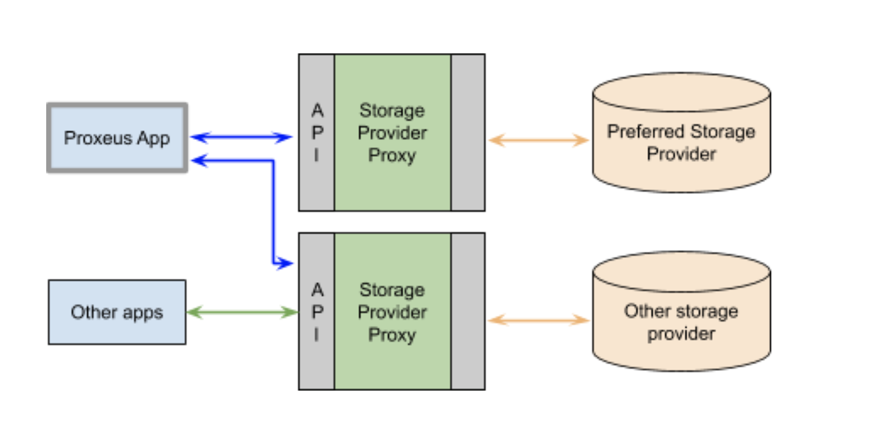

# Architecture high-level Overview

Proxeus’ concept for off-chain file storage comprises several components that are described below. 
 

 
## Storage App Client
Any developer can build an app that takes advantage of all the features the Storage Provider Proxy offers. The client could be as simple as a website with some javascript and libraries for PGP and MetaMask. Or it could be a very advanced app that stores documents automatically without user interaction.
 

## SPP / Storage Provider Proxy
The Proxeus Storage Provider Proxy provides powerful functionality - and DApps created by the Proxeus community will make it very simple to take advantage of those features. The users may not even know that they are doing something on the blockchain - but that’s all up to the app developers.
It is a gateway between DApps, storage providers and the blockchain. It creates completely new opportunities for storage providers and app creators by utilizing some of the most powerful advantages of the blockchain such as the verification of a document’s author and integrity - and only very basic blockchain knowhow is required. 
Firstly, the SPP enables anyone to set up and run a storage system in the Proxeus ecosystem. Secondly, its API makes it easy for app developers to use the storage provided by others and empowers them to add powerful features to their apps. Developers may partner up with one or several storage providers, or even decide to run their own storage service.

## Smart contract

The Proxeus Storage Provider Proxy connects to a smart contract. The contract manages a list of stored files, each with the (unencrypted) file’s hash, a sharing list, the owner and the storage URI. It is deployed separately for each instance (=storage provider).
Furthermore, the smart contract manages the XES payments of the stored files. It pays out the fee to the storage provider.

##Storage

The storage system of the provider is connected to a backend interface of the SPP. This could be a simple server, a cloud or a new approach like the file storage protocol and network of IPFS.

Proxeus will design an abstraction layer for the file input and output operations. Adapters for additional protocols can be implemented easily. 

## PGP-Server
PGP-Server is an address book concept for easy file sharing with known contacts. When a user logs in for the first time the Storage app client creates a new wallet and pgp-key. The ethereum address of the wallet and the pgp-public-key is shared with the pgp server.
by knowing someones ethereum address users can request a users pgp-public-key and then easily share encrypted files among each other by encrypting files with the public key.